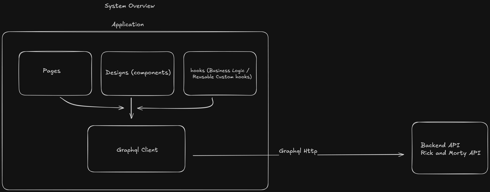
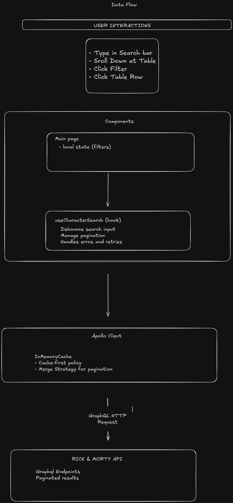
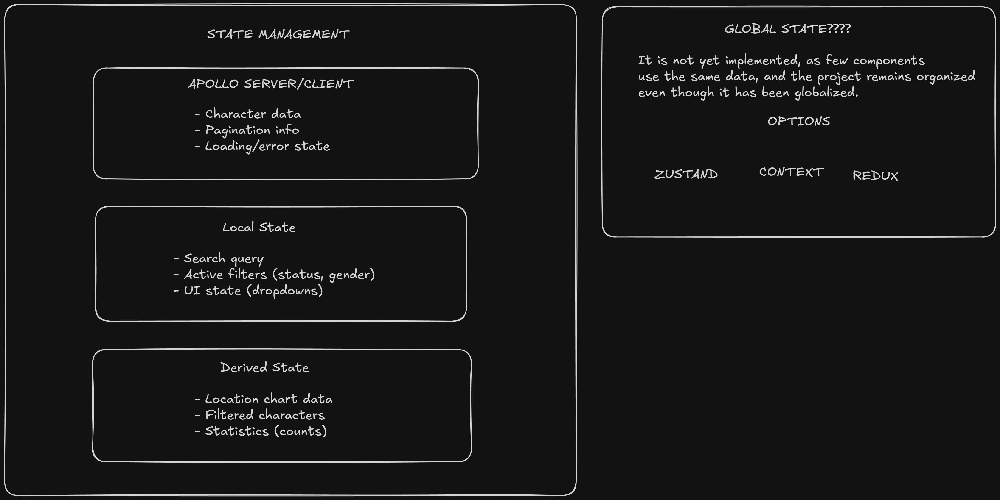
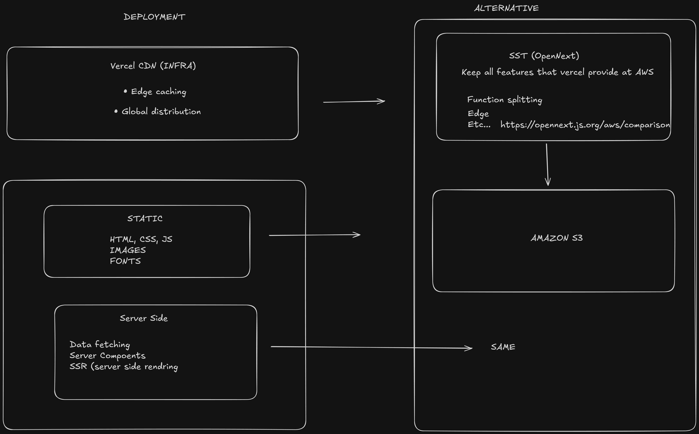

# Rick and Morty Dashboard

A modern, performant Next.js dashboard that consumes the Rick & Morty GraphQL API to display and search characters with infinite scrolling, interactive charts, and advanced filtering capabilities.


## 🚀 Features

### Core Functionality
- **Infinite Scroll Table**: Browse all Rick & Morty characters with seamless pagination
- **Live Search**: Debounced search by character name with instant results
- **Interactive Pie Chart**: Visualize character distribution across locations
- **Advanced Filters**: Filter by status (Alive/Dead/Unknown) and gender (Male/Female/Unknown)
- **Character Details**: Click any character to view detailed information including episodes

### Technical Highlights
- **GraphQL Integration**: Apollo Client with cursor-based pagination
- **Atomic Design**: Clean component architecture (Atoms → Molecules → Organisms → Pages)
- **Component Composition**: Reusable TableRow components with flexible composition patterns
- **Performance Optimized**: Lighthouse score optimizations, debounced search, memoization
- **TypeScript**: Full type safety throughout the application
- **Responsive**: Mobile-friendly design with adaptive layouts

## 📋 Prerequisites

- Node.js 18+
- npm or yarn

## 🛠️ Installation

```bash
# Clone the repository
git clone https://github.com/ArthurJFreitas/rickandmorty-alternative
cd rick-morty-dashboard

# Install dependencies
npm install

# Run the development server
npm run dev
```
Open [http://localhost:3000](http://localhost:3000) to view the dashboard.

## Run Tests

```bash
# Run tests
npm test

# Run tests with coverage
npm run test:ci

# Run tests in watch mode
npm run test
```

## System Design - Rick and Morty Dashboard






## 🏗️ Project Structure

```
src/
├── app/                          # Next.js App Router
│   ├── layout.tsx               # Root layout with Apollo Provider & metadata
│   ├── page.tsx                 # Dashboard page (main view)
│   ├── globals.css              # Global styles and Tailwind imports
│   └── character/
│       └── [id]/
│           └── page.tsx         # Character detail page (dynamic route)
│
├── assets/                       # Static assets
│   └── logo.png                 # Rick and Morty logo
│
├── components/                   # Atomic Design Structure
│   ├── atoms/                   # Basic building blocks
│   │   ├── Avatar.tsx          # Character avatar component
│   │   ├── Badge.tsx           # Status badges (Alive/Dead/Unknown)
│   │   ├── Button.tsx          # Reusable button with variants
│   │   ├── Card.tsx            # Container card component
│   │   ├── Input.tsx           # Form input component
│   │   ├── Spinner.tsx         # Loading spinner
│   │   └── __tests__/          # Unit tests for atoms
│   │
│   ├── molecules/              # Combinations of atoms
│   │   ├── CharacterTableRow.tsx  # Character-specific table row
│   │   ├── CustomDropdown.tsx     # Dropdown filter component
│   │   ├── FilterDropdown.tsx     # Alternative filter component
│   │   ├── SearchInput.tsx        # Search with clear button
│   │   ├── TableRow.tsx           # Generic table row component
│   │   └── __tests__/             # Unit tests for molecules
│   │
│   └── organisms/              # Complex UI sections
│       ├── CharacterTable.tsx # Infinite scroll virtualized table
│       ├── ErrorBoundary.tsx  # Error handling wrapper
│       ├── LocationChart.tsx  # Pie chart with Recharts
│       └── __tests__/         # Unit tests for organisms
│
├── hooks/                        # Custom React hooks
│   ├── index.ts                 # Barrel export
│   ├── useAbortController.ts    # Request cancellation
│   ├── useCharacterSearch.ts    # Main character search hook
│   ├── useDebounce.ts           # Debounce utility hook
│   ├── useInfiniteScroll.ts     # Intersection Observer hook
│   ├── useScrollFade.ts         # Scroll animation hook
│   └── __tests__/               # Hook tests
│
├── lib/                          # Utilities
│   └── utils/
│       ├── characterProcessing.ts  # Data transformation utilities
│       └── style.ts                # Tailwind merge helpers (cn)
│
├── services/                     # External service integrations
│   └── graphql/
│       ├── client.ts            # Apollo Client configuration
│       ├── index.ts             # Barrel export
│       ├── provider.tsx         # Apollo Provider component
│       ├── types.ts             # GraphQL TypeScript types
│       └── queries/
│           ├── characters.ts    # Character queries
│           └── locations.ts     # Location queries
│
└── test-utils/                   # Testing utilities
    ├── mock-data.ts             # Mock character/location data
    └── test-utils.tsx           # Custom render with providers
```

## 🧩 Component Architecture

### Atomic Design Implementation

#### **Atoms** (Basic Building Blocks)
- `Badge`: Status indicators with variants (success/danger/default)
- `Button`: Interactive buttons with loading states
- `Card`: Container components with elevation variants
- `Input`: Form inputs with error handling
- `Spinner`: Loading indicators with sizes

#### **Molecules** (Component Combinations)
- `SearchInput`: Search field + clear button + icon
- `TableRow`: Generic reusable table row with click handling
- `CharacterTableRow`: Character-specific row using composition
- `FilterDropdown`: Filter select with options

#### **Organisms** (Complex Sections)
- `CharacterTable`: Complete table with headers, infinite scroll, and search
- `LocationChart`: Interactive pie chart with Recharts
- `ErrorBoundary`: Error handling and retry logic

#### **Pages** (Complete Views)
- Dashboard: Main page composing all organisms
- Character Detail: Individual character view with episodes

### Composition Pattern Example

```tsx
// Base reusable component
<TableRow onClick={handleClick}>
  <TableCell align="center">Content</TableCell>
  <TableCell>More content</TableCell>
</TableRow>

// Specialized component using composition
<CharacterTableRow
  character={character}
  onClick={handleClick}
/>
```

## 🔧 Key Technologies

- **Framework**: Next.js 16.1.6 (App Router)
- **Language**: TypeScript 5
- **Data Fetching**: Apollo Client 4.1.3
- **Styling**: Tailwind CSS 4
- **Icons**: Phosphor Icons 2.1.10
- **Charts**: Recharts 3.7.0
- **Testing**: Jest 30 + React Testing Library 16
- **Type Variants**: class-variance-authority 0.7.1

## ✨ Design Decisions

### 1. **Component Composition over Configuration**
Rather than complex prop drilling, I use composition patterns:
- `TableRow` + `TableCell` as building blocks
- `CharacterTableRow` composes these for specific use
- Easy to extend for new table types

### 2. **Debounced Search**
600ms debounce on search prevents excessive API calls while maintaining responsive UX.

### 3. **Intersection Observer for Infinite Scroll**
Uses native browser API for efficient scroll detection with proper cleanup.

### 4. **Optimistic UI Updates**
Loading states are carefully managed to avoid layout shift and provide smooth UX.


## 📊 Performance Optimizations

### Implemented Optimizations
1. **Debounced Search**: Reduces API calls
2. **Memoization**: `useMemo` for expensive computations (React 19 Compiler enabled, no manual optimizations needed for memoization)
3. **Lazy Loading**: Images load on-demand
4. **Virtual Scrolling Ready**: Table structure supports virtualization (Not needed right now, but if the list size increases, it will be supported)
5. **Code Splitting**: Next.js automatic code splitting
6. **Optimized Imports**: Tree-shaking enabled

### Lighthouse Scores (Target)
- Performance: 95+
- Accessibility: 95+
- Best Practices: 95+
- SEO: 100


## 🔄 Data Flow

```
User Action → Component State → GraphQL Query → Apollo Cache → UI Update
                                      ↓
                              Optimistic Updates & Loading States
```

### Search Flow
```
User Types → Debounce (600ms) → GraphQL Query → Results Update → Chart Update
```

### Infinite Scroll Flow
```
Scroll to Bottom → Intersection Observer → Load More → Append Results
```

## 🚧 Trade-offs & Future Enhancements

### What Was Prioritized
- ✅ Clean, maintainable code architecture
- ✅ Comprehensive testing
- ✅ Smooth UX with loading states
- ✅ Type safety throughout

### Nice-to-Have Features (Not Implemented, but could be) | extra mile
- ⏳ Sort by columns (maybe use: React Table or TanStack Table)
- ⏳ Export data functionality
- ⏳ Virtual scrolling for extremely large datasets (Maybe use: TanStack Virtual or React Virtual)
- ⏳ Sort by columns
- ⏳ Bookmark/favorite characters
- ⏳ Advanced filter combinations

### Technical Debt Noted
- Could implement React Query for simpler data fetching
- Could implement Redux or Zustand for state management 
- Could implement Auth and save some user data (Favorites, Settings, etc.)
- Add ligh/darkmode toggle
- Add .env variables when necessary
- Add E2E tests (Playwright or Cypress)

## 📝 Scripts

```bash
npm run dev            # Start development server
npm run build          # Build for production
npm run start          # Start production server
npm run lint           # Run ESLint
npm run test           # Run tests in watch mode
npm run test:ci        # Run tests with coverage
npm run type-check     # TypeScript type checking
npm run format         # Format code with Prettier
npm run storybook      # Start Storybook component library
npm run build-storybook # Build Storybook for production
```

## 📖 Storybook

This project includes a comprehensive **Storybook** for developing and testing UI components in isolation.

```bash
# Start Storybook
npm run storybook
```

Access Storybook at [http://localhost:6006](http://localhost:6006)

Built with ❤️ by **Arthur Freitas** • 2026

**API**: [Rick and Morty API](https://rickandmortyapi.com/documentation/)
